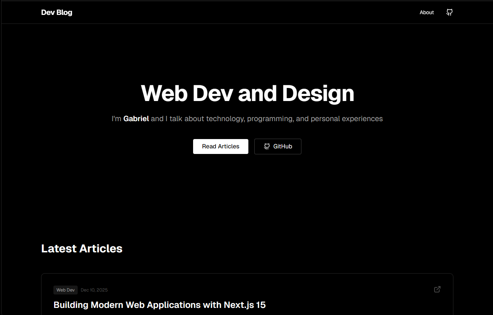

<h1 align="center">Dev Blog</h1>
<div align="center" style="display: flex; gap: 10px; margin: 24px 0;">


</div>
<p align="center"></p>

## Tabla de contenidos:

---

- [Descripción y contexto](#descripción-y-contexto)
- [Guía de usuario](#guía-de-usuario)
- [Guía de instalación](#guía-de-instalación)
- [Cómo contribuir](#cómo-contribuir)
- [Código de conducta](#código-de-conducta)
- [Autor/es](#autores)
- [Licencia](#licencia)

## Descripción y contexto

---

**Dev Blog** es un espacio personal curado para compartir conocimientos sobre tecnología, programación y diseño. Este proyecto sirve como un "playground" moderno para experimentar con las últimas tecnologías web mientras se proporciona contenido valioso a la comunidad de desarrolladores.

El objetivo principal es ofrecer una experiencia de lectura fluida con una interfaz estética (Dark Mode), micro-interacciones suaves y una arquitectura robusta basada en **Next.js 16**.

### Características principales:

- **Estética Moderna**: Diseño limpio con modo oscuro utilizando Tailwind CSS v4.
- **Alto Rendimiento**: Construido sobre Next.js (App Router) y React 19.
- **Micro-interacciones**: Animaciones sutiles para mejorar la experiencia de usuario.
- **Componentes Reutilizables**: Arquitectura modular basada en primitivos de Radix UI.
- **Totalmente Responsivo**: Optimizado para móviles, tablets y escritorio.

## Guía de usuario

---

La plataforma está diseñada para ser intuitiva. Los usuarios pueden:

1. Navegar por la lista de artículos en la página de inicio.
2. Leer artículos detallados sobre desarrollo web.
3. Interactuar con elementos de la interfaz que responden al cursor.

## Guía de instalación

---

A continuación se detalla el paso a paso para instalar y ejecutar el proyecto localmente.

### Requisitos del sistema

- **Node.js**: Se recomienda la última versión LTS.
- **pnpm**: Gestor de paquetes preferido (aunque npm o yarn también funcionan).

### Dependencias

El proyecto utiliza varias librerías clave que se instalarán automáticamente, incluyendo:

- `next`
- `react`, `react-dom`
- `tailwindcss`, `clsx`, `tailwind-merge`
- `lucide-react` (Iconos)

### Pasos de instalación

1. **Clonar el repositorio**

   ```bash
   git clone https://github.com/Gabo2447/dev-blog.git
   cd dev-blog
   ```

2. **Instalar dependencias**

   ```bash
   pnpm install
   ```

3. **Iniciar el servidor de desarrollo**

   ```bash
   pnpm dev
   ```

4. **Verificar la instalación**
   Abre tu navegador y navega a [http://localhost:3000](http://localhost:3000).

## Cómo contribuir

---

¡Las contribuciones son bienvenidas! Si deseas mejorar el blog, por favor sigue estos pasos:

1. Haz un **Fork** del proyecto.
2. Crea una rama para tu funcionalidad (`git checkout -b feature/NuevaFuncionalidad`).
3. Realiza tus cambios y haz **Commit** (`git commit -m 'feat: Agrega nueva funcionalidad'`).
4. Haz **Push** a la rama (`git push origin feature/NuevaFuncionalidad`).
5. Abre un **Pull Request**.

Por favor, asegúrate de mantener el estilo de código existente y ejecutar el linter antes de enviar tus cambios.

## Código de conducta

---

Este proyecto busca fomentar un ambiente abierto y acogedor. Esperamos que todos los participantes se comporten con respeto y profesionalismo, libre de acoso y discriminación.

## Autor/es

---

**Gabriel**

- GitHub: [@gabo2447](https://github.com/gabo2447)

## Licencia

---

Este proyecto está distribuido bajo la licencia **MIT**. Consulta el archivo `LICENSE` para más información.
